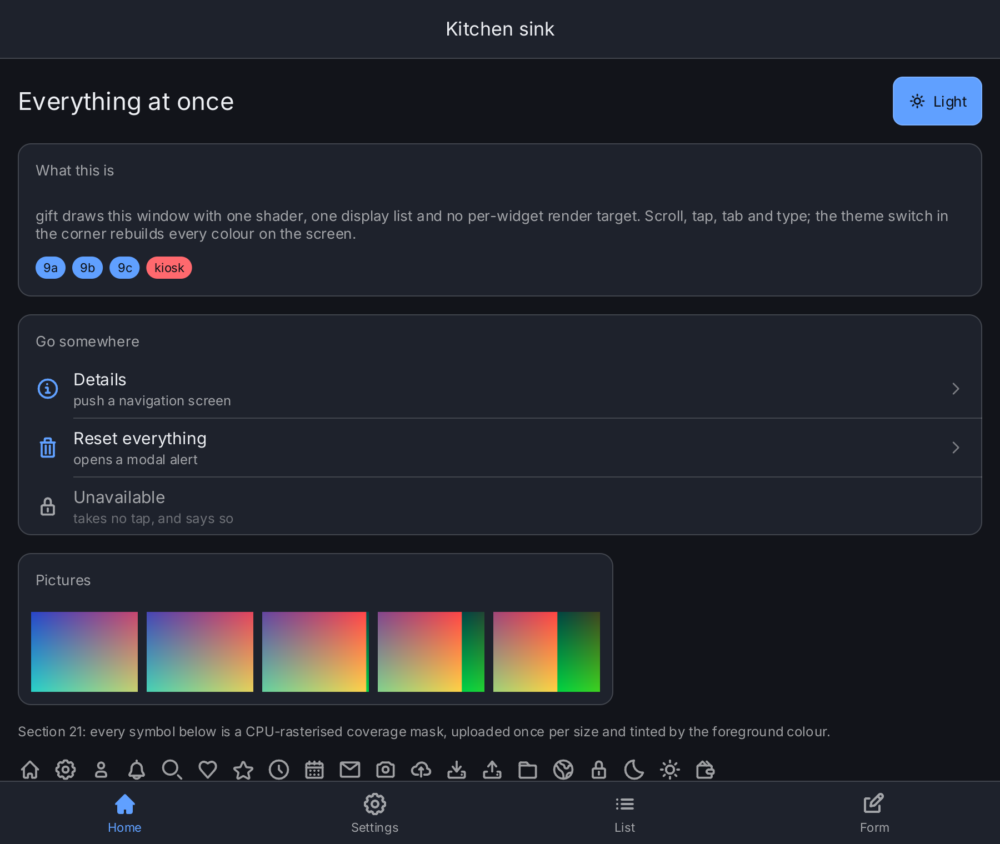
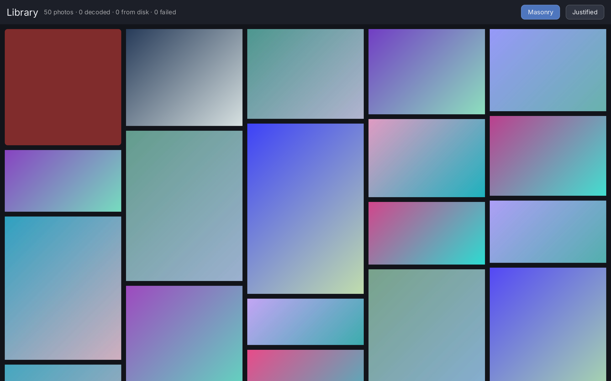
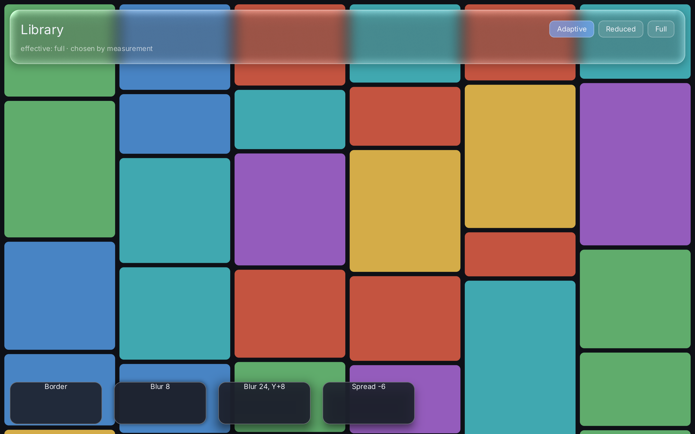

# Gift

Gift is a declarative UI toolkit for Go: SwiftUI-style views, typed state and
GPU rendering with [Ebitengine](https://ebitengine.org/), without a browser or
WebView. It focuses on desktop and touchscreen kiosk applications, particularly
on Raspberry Pi 4 and 5.

## Why?

Go applications should be able to describe their interfaces directly in Go,
without bringing along a web stack. Gift combines small, composable views with
targeted state updates instead of repeatedly rebuilding the entire UI.
Virtualized galleries, asynchronous image loading and bounded resource budgets
are designed for image-heavy interfaces on modest hardware.

**Under development:** APIs may still change. 1080p at 60 Hz on Raspberry Pi is
a target, not a verified performance guarantee.

## What It Looks Like

Actual framebuffer captures of the running examples, taken with `giftauto`.

**Kitchen Sink:** Navigation, tabs, forms, an on-screen keyboard, icons and
switchable light/dark themes.



| Image Gallery | Effects |
| --- | --- |
|  |  |
| Masonry/justified layouts, selection, file/HTTP sources and a thumbnail cache. The red tile demonstrates a loading error. | Shadows, rounded shapes and experimental glass with adjustable quality. |

## Try It

Requires **Go 1.27** and a graphical session with GPU support. The examples
include Inter as an embedded font. The intended Raspberry Pi setup is
Raspberry Pi OS 64-bit with X11/XWayland and hardware-accelerated Mesa;
builds do not require CGO.

From the cloned repository, run one example at a time:

```sh
go run ./cmd/example-counter      # Start here: state, buttons, scrolling
go run ./cmd/example-kitchensink  # UI component showcase
go run ./cmd/example-gallery      # Generates its own sample images
go run ./cmd/example-effects -quality=full
```

Use your own JPEG/PNG images: `go run ./cmd/example-gallery -dir "$HOME/Pictures"`.
Interact using a mouse, keyboard or touch; the gallery also supports drag scrolling.

## Your Own Application

Add the module with `go get github.com/worldiety/gift`. Views are Go functions;
state is created in the context, and changes rebuild the views that depend on it:

```go
func counter(ctx *gift.Context) gift.View {
    count := ctx.State("count", 0)
    n := ctx.Read(count)
    return ui.Window(ui.VStack(
        ui.Text(fmt.Sprintf("%d clicks", n)),
        ui.Button(ui.Text("+1"), func() { count.Set(count.Get() + 1) }),
    ).Gap(16).Padding(24))
}
```

`gift.New(gift.Options{Root: counter})` creates the app; `backend.Run` from
`github.com/worldiety/gift/backend/ebiten` opens the window. The application
explicitly sets its font and window size. See
[`cmd/example-counter`](cmd/example-counter/main.go) for a complete example.

## Testing And Automation

```sh
go test ./...
go test -tags giftauto ./...
# Pixel tests using a real GPU and existing reference images:
GIFT_REQUIRE_GOLDEN=1 go test -tags giftgpu ./...
```

For automation and screenshots, the build tag alone is enough. No extra source
file or side-effect import is needed in the application:

```sh
go run -tags giftauto ./cmd/example-kitchensink
# In a second terminal:
curl -fsS http://127.0.0.1:7391/tree
curl -fsS 'http://127.0.0.1:7391/screenshot?settle=8' -o screenshot.png
```

**Do not ship with `giftauto`:** It enables an unauthenticated local debugging
interface for input and screen capture. Without the tag, it is not included in
the backend. See [`auto`](auto/doc.go),
[reproducing the screenshots](docs/screenshots/README.md) and
[architecture and goals](PLAN.md) (in German).

## License

[BSD-2-Clause](LICENSE). Embedded fonts and icons have their own license notices
in their package directories.
